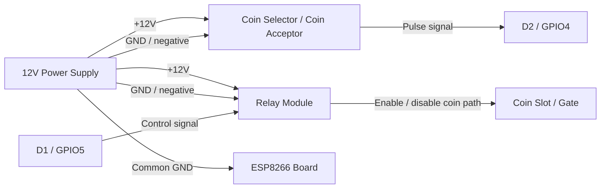

# InternetCafe ESP

InternetCafe ESP is the firmware used by the ESP8266-based coin slot controller in the InternetCafe System.

The ESP device connects the café's coin acceptor to the InternetCafe Server and communicates with the server over the local network.

The ESP firmware is maintained in a separate repository. This repository contains the **released firmware binary** used when deploying an InternetCafe System release.

> **Source Code:** [InternetCafe ESP Repository](https://github.com/ed-dev-oc/InternetCafeESP)

## Role in InternetCafe System

The ESP device sits between the physical coin acceptor and the InternetCafe Server.

```text
                    InternetCafe Server
                           │
                           │ HTTP / HMAC
                           │
                           ▼
                    ┌──────────────┐
                    │ ESP8266      │
                    │ Coin Device  │
                    └──────┬───────┘
                           │
                 ┌─────────┴─────────┐
                 │                   │
                 ▼                   ▼
          Coin Acceptor         Coin Relay
```

The ESP is responsible for:

* Connecting to the café Wi-Fi network
* Registering with the InternetCafe Server
* Sending device heartbeats
* Detecting coin pulses
* Reporting coin events to the server
* Enabling and disabling the coin acceptor
* Maintaining a persistent outbound task queue
* Receiving remote configuration
* Supporting remote reboot
* Persisting device configuration locally

The ESP does **not** replace the InternetCafe Server. The server remains responsible for the central application, PC sessions, users, and café management.

## Hardware

The firmware currently targets an ESP8266 NodeMCU v2 / ESP-12E-compatible board.

### Pin Configuration

| Function          | ESP8266 Pin |  GPIO | Direction | Behavior                                           |
| ----------------- | ----------- | ----: | --------- | -------------------------------------------------- |
| Coin pulse input  | D2          | GPIO4 | Input     | Uses `INPUT_PULLUP` and counts falling-edge pulses |
| Coin relay output | D1          | GPIO5 | Output    | Active-low relay control                           |

### Required Hardware

The typical coin controller consists of:

* ESP8266 NodeMCU v2 / ESP-12E-compatible board
* Coin selector / coin acceptor with pulse output
* Relay module for coin gating
* Appropriate power supply
* Network access through the café's Wi-Fi

### Hardware Notes

The coin pulse input uses a pull-up configuration and detects falling-edge pulses.

The firmware performs pulse debouncing to prevent a single coin event from being incorrectly counted multiple times.

The relay output is active-low:

```text
LOW  = coin acceptor enabled
HIGH = coin acceptor disabled
```

The relay is initialized in the disabled state.

For bench testing, the firmware supports the `DRY_RUN` configuration option, which can be used to prevent actual hardware I/O.

### Power and Signal Wiring

The power wiring is separate from the signal wiring:



## Firmware Release

Released firmware is included in the InternetCafe System distribution repository.

For example:

```text
releases/
└── 1.0.0/
    └── esp/
        └── firmware-1.0.0.bin
```

The firmware filename follows the release version:

```text
firmware-<version>.bin
```

For release `1.0.0`:

```text
firmware-1.0.0.bin
```

The firmware binary is the file that should be flashed to the ESP8266 during deployment.

## Firmware Repository

The ESP firmware source code is maintained separately.

The ESP repository contains:

* C++ source code
* PlatformIO configuration
* Development and release build environments
* HTTP controllers
* Wi-Fi handling
* HMAC handling
* Coin detection
* Relay control
* Persistent configuration
* Device registration
* Outbound task queue
* Development-only debug routes

The main InternetCafe System repository does not contain the ESP source code.

It contains the release artifact required for deployment.

## Flashing the Firmware

The released `.bin` firmware can be flashed using an ESP8266-compatible flashing tool.

The deployment process can use tools such as:

* Espressif Flash Download Tool
* PlatformIO
* Other compatible ESP8266 flashing tools

For customer deployment, the recommended approach is to use the firmware binary included with the corresponding InternetCafe System release.

Example:

```text
releases/1.0.0/esp/firmware-1.0.0.bin
```

### Espressif Flash Tool

When using the Espressif Flash Download Tool, select the ESP8266-compatible configuration and provide the released firmware binary.

The firmware is intended to be flashed at the firmware image address required by the ESP8266 firmware build.

**Do not assume the address is `0x00000` or `0x10000` without checking the release's flashing instructions.**

The flashing layout should be documented with the release if the firmware requires multiple binary files or specific flash addresses.

For a release containing a single merged firmware image, use the flashing address specified by that release.

## Initial Device Configuration

After flashing the firmware, the ESP8266 must be configured before it can communicate with the InternetCafe Server.

The firmware supports a setup access point when normal Wi-Fi station connection is not available.

The device configuration includes settings such as:

```text
wifi_ssid
wifi_password
device_name
server_url
admin_password
use_static_ip
local_ip
gateway
subnet
primary_dns
secondary_dns
```

The exact configuration process is implemented by the ESP firmware.

## Network Configuration

The ESP device communicates with the InternetCafe Server over the café's local network.

The ESP should be configured to use the server's LAN address.

For example:

```text
Server:
192.168.1.100:3000

ESP:
server_url = http://192.168.1.100:3000
```

The server computer should preferably use a **static IP address or a DHCP reservation** so that the ESP does not lose the server address after a router restart or DHCP lease change.

The ESP itself also supports static IP configuration.

Available settings include:

```text
use_static_ip
local_ip
gateway
subnet
primary_dns
secondary_dns
```

Static IP configuration should only be used when the selected address is appropriate for the café's network.

## Device Registration

An ESP device must register with the InternetCafe Server before normal operation.

Registration establishes the device's identity and security credentials.

The firmware maintains a local secret used for protected communication.

After registration, the device can communicate with protected server endpoints using HMAC authentication.

## Server Communication

The ESP communicates with the InternetCafe Server using HTTP requests.

Protected requests use HMAC headers:

```text
X-SIGNATURE
X-TIMESTAMP
```

The timestamp helps protect requests against replay.

The ESP periodically sends heartbeat information to the server.

The server can also send tasks to the ESP, including operations such as:

* Enable coin acceptor
* Disable coin acceptor
* Remote configuration
* Reboot
* Other device tasks introduced by future releases

## Coin Detection

The coin acceptor produces electrical pulses when a coin is inserted.

The ESP monitors the coin pulse input:

```text
Coin Acceptor
      │
      │ pulse
      ▼
 ESP8266 GPIO4
      │
      ▼
 Coin detection
      │
      ▼
 Coin event
      │
      ▼
 InternetCafe Server
```

The firmware aggregates and processes the pulses before reporting the coin event to the server.

The exact pulse configuration depends on the coin acceptor being used.

## Coin Relay

The relay controls whether the coin acceptor is allowed to accept coins.

The relay is active-low:

```text
GPIO5 LOW
    │
    ▼
Coin acceptor enabled

GPIO5 HIGH
    │
    ▼
Coin acceptor disabled
```

The server can instruct the ESP to enable or disable the coin acceptor depending on the PC session state.

## Persistent Storage

The ESP uses LittleFS for local persistence.

The firmware stores important device information in files such as:

```text
/device_settings.json
/secret.txt
/http_queue.jsonl
```

### `device_settings.json`

Contains persistent device configuration such as:

* Wi-Fi settings
* Server URL
* Device name
* Static IP configuration

### `secret.txt`

Contains device registration/security information.

### `http_queue.jsonl`

Contains queued outbound tasks/events that have not yet been successfully delivered to the server.

Persistent storage allows the device to recover configuration and queued information after a restart.

## Offline and Connection Recovery

The ESP is designed to tolerate temporary network interruptions.

When the server cannot be reached, outbound tasks can be placed into a persistent queue.

The device can later retry queued communication when connectivity is restored.

This prevents temporary network problems from immediately losing locally generated events.

The queue is stored in LittleFS so that queued information can survive an ESP restart.

## Development and Release Builds

The ESP firmware repository uses PlatformIO build environments.

The two environments are:

```text
development
release
```

Development builds define:

```text
ENV_DEVELOPMENT
```

Release builds define:

```text
ENV_RELEASE
```

Development builds may include debugging routes such as:

```text
POST /debug/coin-insert
GET /debug/queue
```

These debug routes are excluded from release firmware.

### Production Deployment

For production deployment, always use the firmware binary from the corresponding InternetCafe System release.

Do not use a development firmware build on a customer's production coin controller.

## Release Structure

ESP firmware releases are stored under the release directory:

```text
releases/
└── <version>/
    └── esp/
        └── firmware-<version>.bin
```

Example:

```text
releases/
└── 1.0.0/
    └── esp/
        └── firmware-1.0.0.bin
```

This keeps the ESP firmware version synchronized with the overall InternetCafe System release.

## Troubleshooting

### ESP Cannot Connect to Wi-Fi

Check:

1. Wi-Fi SSID
2. Wi-Fi password
3. Wi-Fi signal
4. ESP power supply
5. Static IP configuration, if enabled

If the device cannot connect using its configured Wi-Fi settings, use the firmware's setup AP/configuration process.

### ESP Cannot Reach the Server

Check:

1. The InternetCafe Server is running.
2. The server computer's LAN IP address has not changed.
3. The ESP and server are connected to the same network.
4. The configured `server_url` is correct.
5. Windows/Linux firewall rules allow the server port.
6. The server is listening on the expected port.

Example:

```text
http://192.168.1.100:3000
```

### Coin Is Not Detected

Check:

1. Coin acceptor power.
2. Coin pulse wiring.
3. ESP GPIO4 / D2 connection.
4. Ground connection.
5. Coin acceptor pulse configuration.
6. Firmware logs.
7. Whether the coin relay is enabled.

### Relay Does Not Enable

Check:

1. Relay power.
2. GPIO5 / D1 connection.
3. Ground connection.
4. Relay module logic.
5. Whether the server has instructed the ESP to enable the coin acceptor.

Remember that the relay output is **active-low**.

## Security

The ESP communicates with protected server endpoints using HMAC authentication.

Do not:

* Share device registration secrets.
* Expose the ESP configuration interface to an untrusted network.
* Publish device credentials.
* Use development firmware in production.
* Connect the ESP to an untrusted public Wi-Fi network.

The ESP should normally operate inside the café's trusted local network.

## Related Projects

### InternetCafe System

The main repository contains:

* Server documentation
* Desktop documentation
* ESP documentation
* Release artifacts
* Installation documentation

### InternetCafe Server

The Rails server provides:

* PC management
* Session management
* User management
* Device management
* REST API
* Background jobs
* Real-time updates

### InternetCafe Desktop

The desktop application runs on café client PCs and communicates with the InternetCafe Server.

### InternetCafe ESP

The ESP8266 firmware provides the physical coin controller functionality.

The ESP source code is maintained in its own repository.

## Project Status

InternetCafe ESP is actively developed.

Firmware behavior, hardware requirements, API endpoints, and configuration options may change between releases.

Always use the firmware and documentation corresponding to the InternetCafe System release being deployed.

## License

The ESP firmware is released according to the license included in the ESP firmware repository.
